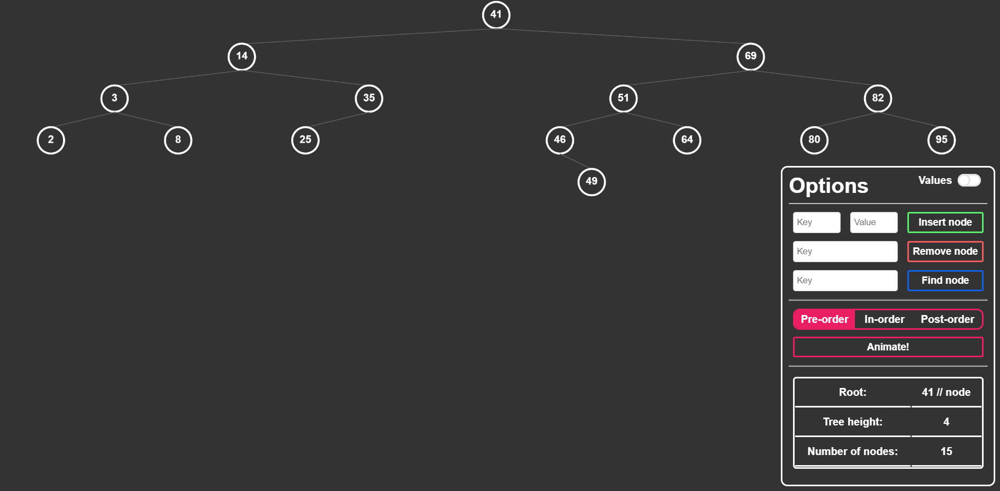

# AVL Tree

Implementation of an AVL Tree in Vanilla JavaScript and p5.js, made for an university project.
**Live version** - https://pamsi-avl-tree.herokuapp.com/

## Brief description

App lets you **insert**, **remove** and **find** a node in AVL Tree which is a type of self-balancing BST.
It also displays some useful info about the tree and has an implementation of Depth-First Searches.
It's been written based on **Object-Oriented Programming** principles.



### Prerequisites

If you want to make some changes, first you have to have [Node with npm](https://nodejs.org/en/) installed.
Then, you have to install dependencies:

```
npm i
```

I also have [nodemon](http://nodemon.io/) installed globally, which restarts server if you make some changes.
It's not appearing in dev dependencies, so for an app to work properly, you should run:

```
npm i nodemon -g
```

And also change start script in **package.json** to:

```
"scripts": {
  ...
  "start": "nodemon server.js"
}
```

### Installation

After cloning this repository, in the project directory, you should run:

```
npm start
```

Then go to your browser of choice and go to the URL below:

```
localhost:3000
```

App should be running in your browser. Give it a try!

## Built With

* [p5.js](https://p5js.org/) - Canvas drawing JS library based on [Processing](https://processing.org/)
* [Express](https://expressjs.com/) - Web server framework for [Node.js](https://nodejs.org/en/)
* [Heroku](https://www.heroku.com/) - Cloud platform which can run Node.js

## Further development

* Adding unit tests with **Jest** (already installed)
* Making an animation section actually work as expected

## Acknowledgments

* Shoutout to one an only [Daniel Shiffman](https://github.com/shiffman) (an actual Java/JS genius), from whom I took an approach how to draw a BST
* Shoutout to [I LO w Tarnowie](http://eduinf.waw.pl/inf/alg/001_search/index.php) which has the best explanation of algorithms and basic data structures available (Polish only)
